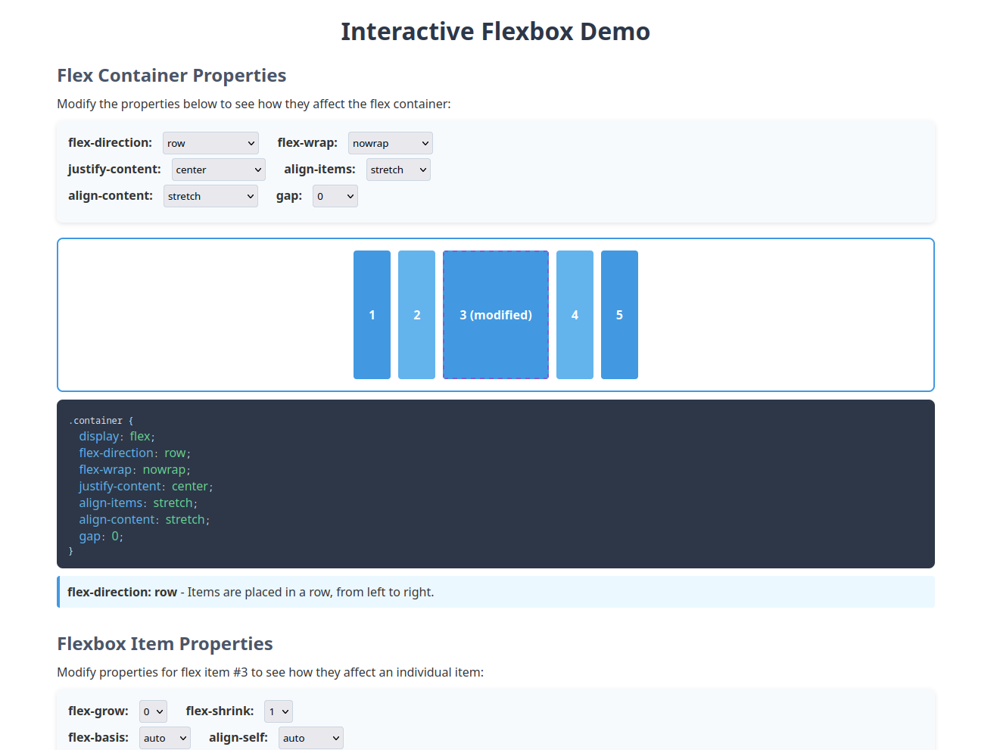

# 📊 Interactive Flexbox Demo

This interactive web application helps you understand CSS Flexbox layout by providing real-time visual demonstrations of various Flexbox properties.

## ✨ Features

### Container Properties
Modify parent container Flexbox properties and see how they affect all items:

| Property | What It Controls |
|----------|------------------|
| `flex-direction` | Direction items are placed in the container (row, column) |
| `flex-wrap` | Whether items wrap to new lines when they run out of space |
| `justify-content` | How items are aligned along the main axis |
| `align-items` | How items are aligned along the cross axis |
| `align-content` | How wrapped lines are aligned in the container |
| `gap` | Space between flex items |

### Item Properties
Modify individual item properties and see how they affect a single item:

| Property | What It Controls |
|----------|------------------|
| `flex-grow` | How much the item will grow relative to others |
| `flex-shrink` | How much the item will shrink relative to others |
| `flex-basis` | The default size of an item before remaining space is distributed |
| `align-self` | Override the container's align-items for just one item |
| `order` | Change the visual order of items |

## 🎓 Educational Features

- **Real-time Updates**: See changes as you select different property values
- **Live Code Display**: View the exact CSS code that creates the effects you see
- **Property Descriptions**: Clear explanations for what each property value does
- **Interactive Elements**: Focus on select fields to see related descriptions

## 🚀 Getting Started

1. Clone or download this repository
2. Open `index.html` in your web browser
3. Start experimenting with the Flexbox controls!

## 📝 Notes for Learners

- The colored boxes represent flex items within a flex container
- Item #3 (with purple dashed border) is the one affected by individual item properties
- Try resizing your browser window to see how flex items respond
- This demo is meant to be exploratory - there's no "right" combination of properties
